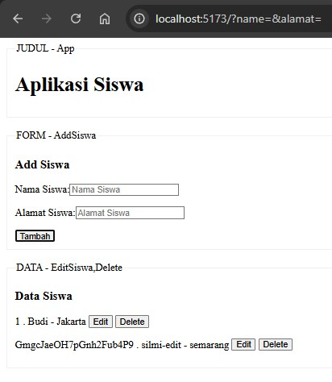
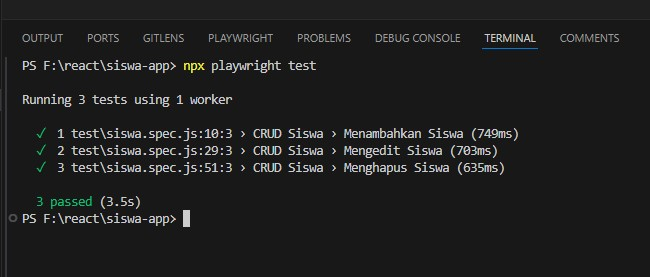

# REACT VITE 2025

## 1. PERSIAPAN AWAL

PERSIAPAN AWAL

```
npm create vite@latest siswa-app --template react
cd siswa-app
npm install
npm install nanoid
npm install --save-dev @playwright/test

```

GITHUB

```
git init
git add .
git commit -m "first commit"
git branch -M main
git remote add origin https://github.com/edycoleee/react25-1.git

```


## 2. MEMBUAT PAGE SISWA

GITHUB

```
git branch 01_mockpage
git checkout 01_mockpage
```

a. membuat halaman HomeSiswa.jsx, AddSiswa.jsx, EditSiswa.jsx
b. membuat mockup fungsi dan log
c. membuat fungsi add >> simpanAdd, edit >> simpanEdit
d. map data siswa untuk menampilkan semua data >> ingat perintah MAP

```js
{
  tbSiswa.map((siswa) => (
    <div key={siswa.id}>
      <p>
        {siswa.id} . {siswa.siswaName} - {siswa.siswaAlamat} {"  "}
        <button>Edit</button>
        {"  "}
        <button>Delete</button>
      </p>
    </div>
  ));
}
```


## 3. MEMBUAT CRUD SISWA

GITHUB

```
git branch 02_crudarray
git checkout 02_crudarray
```

### PENGETAHUAN TENTANG OPERASI ARRAY OBJECT

Operasi : Metode yang digunakan

#### 1. CREATE (Menambahkan Data Baru)

Create : `.push()`, .concat()

```js
let newSiswa = {
  id: 4,
  siswaName: "Dewi",
  siswaAlamat: "Yogyakarta",
};
tbSiswa.push(newSiswa); // Menambahkan objek ke array
console.log(tbSiswa);
```

Spread Operator >> quickly copy all or part of an existing array or object into another array or object

```js
const numbersOne = [1, 2, 3];
const numbersCombined = [...numbersOne, 4, 5];
```

#### 2. READ (Membaca Data)

Read : .map(), .forEach(), `.find()`

```js
const findSiswa = tbSiswa.find((siswa) => siswa.id === 2);
console.log(findSiswa);
```

#### 3. UPDATE (Memperbarui Data)

Update : `.map()`, .findIndex()

```js
tbSiswa = tbSiswa.map((siswa) =>
  siswa.id === 2 ? { ...siswa, siswaAlamat: "Semarang" } : siswa
);
console.log(tbSiswa);
```

#### 4. DELETE (Menghapus Data)

Delete : `.filter()`, .splice()

```js
tbSiswa = tbSiswa.filter((siswa) => siswa.id !== 3);
console.log(tbSiswa);
```

### Memindahkan semua fungsi ke HomeSiswa.jsx

#### 1. READ (Membaca Data)

```js
<EditSiswa tbSiswa={tbSiswa} />
```

#### 2. CREATE (Menambahkan Data Baru)

```js
//src/pages/siswa/HomeSiswa.jsx
.....
  const [tbSiswa, setTbSiswa] = useState(tbSiswaAwal);

  const addSiswa = (siswa) => {
    siswa.id = nanoid();
    setTbSiswa([...tbSiswa, siswa]);
  };

......

<AddSiswa addSiswa={addSiswa} />

```

```js
//src/pages/siswa/AddSiswa.jsx
import React, { useState } from 'react';

function AddSiswa({ addSiswa }) {

  const [siswaName, setSiswaName] = useState('');
  const [siswaAlamat, setSiswaAlamat] = useState('');

  const handleSubmit = (e) => {
    e.preventDefault();
    const siswa = { siswaName, siswaAlamat };
    addSiswa(siswa);

    setSiswaName('');
    setSiswaAlamat('');
  };


```

#### 3. DELETE (Menghapus Data)

```js
//src/pages/siswa/HomeSiswa.jsx
....
  const deleteSiswa = (id) => {
    setTbSiswa(tbSiswa.filter((siswa) => siswa.id !== id));
  };

```

```js
//src/pages/siswa/EditSiswa.jsx
import React from "react";

function EditSiswa({ tbSiswa, deleteSiswa }) {
  const setEditSiswa = (siswa) => {
    console.log("EDIT SISWA :", siswa);
  };

  return (
    <div>
      {tbSiswa.map((siswa) => (
        <div key={siswa.id}>
          <p>
            {siswa.id} . {siswa.siswaName} - {siswa.siswaAlamat} {"  "}
            <button onClick={() => setEditSiswa(siswa)}>Edit</button>
            {"  "}
            <button onClick={() => deleteSiswa(siswa.id)}>Delete</button>
          </p>
        </div>
      ))}
    </div>
  );
}

export default EditSiswa;
```

#### 4. UPDATE (Memperbarui Data)



- membuat state update >> membedakan simpan tambah atau simpan update

```js
//tombol edit >> state setEditSiswa(siswa)
//src/pages/siswa/EditSiswa.jsx
import React from "react";

function EditSiswa({ tbSiswa, deleteSiswa, setEditSiswa }) {
  return (
    <div>
      {tbSiswa.map((siswa) => (
        <div key={siswa.id}>
          <p>
            {siswa.id} . {siswa.siswaName} - {siswa.siswaAlamat} {"  "}
            <button onClick={() => setEditSiswa(siswa)}>Edit</button>
            {"  "}
            <button onClick={() => deleteSiswa(siswa.id)}>Delete</button>
          </p>
        </div>
      ))}
    </div>
  );
}

export default EditSiswa;
```

```js
//src/pages/siswa/AddSiswa.jsx
import React, { useEffect, useState } from "react";

function AddSiswa({ addSiswa, editSiswa, updateSiswa, setEditSiswa }) {
  const [siswaName, setSiswaName] = useState("");
  const [siswaAlamat, setSiswaAlamat] = useState("");

  //setiap ada perubahan state editSiswa >> use effect akan auto update
  useEffect(() => {
    if (editSiswa) {
      // mengisi state name alamat dengan data dari editsiswa
      setSiswaName(editSiswa.siswaName);
      setSiswaAlamat(editSiswa.siswaAlamat);
    } else {
      setSiswaName("");
      setSiswaAlamat("");
    }
  }, [editSiswa]);

  const handleSubmit = (e) => {
    e.preventDefault();
    const siswa = { siswaName, siswaAlamat };
    // jika edit siswa tidak null >> edit siswa
    if (editSiswa) {
      // ambil id dari editSiswa >> masukkan ke state siswa
      // variabel siswa >> siswaName, siswaAlamat ,id >> kirim ke fungsi update >> kembalikan state edit ke semula = null
      siswa.id = editSiswa.id;
      updateSiswa(siswa);
      setEditSiswa(null);
    } else {
      addSiswa(siswa);
    }
    setSiswaName("");
    setSiswaAlamat("");
  };

  return (
    <div>
      <form onSubmit={handleSubmit}>
        <label>
          Nama Siswa:
          <input
            type="text"
            placeholder="Nama Siswa"
            value={siswaName}
            onChange={(e) => setSiswaName(e.target.value)}
            required
          />
        </label>
        <p />
        <label>
          Alamat Siswa:
          <input
            type="text"
            placeholder="Alamat Siswa"
            value={siswaAlamat}
            onChange={(e) => setSiswaAlamat(e.target.value)}
            required
          />
        </label>
        <p />
        <button type="submit">{editSiswa ? "Update" : "Tambah"}</button>
      </form>
    </div>
  );
}

export default AddSiswa;
```

- membuat fungsi simpan edit

```js
const updateSiswa = (updatedSiswa) => {
  setTbSiswa(
    tbSiswa.map((siswa) =>
      siswa.id === updatedSiswa.id ? updatedSiswa : siswa
    )
  );
};
```

## 4. MEMBUAT UNIT TEST


GITHUB

```
git branch 03_unittest
git checkout 03_unittest
npx playwright install
```

```js
//src/pages/siswa/HomeSiswa.jsx
import React, { useState } from 'react';
import AddSiswa from './AddSiswa';
import EditSiswa from './EditSiswa';
import { nanoid } from 'nanoid';

function HomeSiswa() {

  const [tbSiswa, setTbSiswa] = useState([]);
  const [editSiswa, setEditSiswa] = useState(null);

  const addSiswa = (siswa) => {
    siswa.id = nanoid();
    setTbSiswa([...tbSiswa, siswa]);
  };
.......... UBAH SEMUA FORM SESUAIKAN DENGAN UNIT TEST SEHINGGA VARIABLE MUDAH DI TEMUKAN SAAT TEST DIJALANKAN
```

data-testid="siswa-id" → untuk menemukan ID siswa.

data-testid="siswa-name" → untuk menemukan nama siswa.

data-testid="siswa-alamat" → untuk menemukan alamat siswa.

data-testid="edit-button-${siswa.id}" → tombol Edit siswa.

data-testid="delete-button-${siswa.id}" → tombol Delete siswa.

```js
//test/siswa.spec.js
// test/siswa.spec.js
import { test, expect } from "@playwright/test";

test.describe("CRUD Siswa", () => {
  test.beforeEach(async ({ page }) => {
    await page.goto("http://localhost:5173/");
  });

  test("Menambahkan Siswa", async ({ page }) => {
    // Create
    await page.fill('input[placeholder="Nama Siswa"]', "Silmi");
    await page.fill('input[placeholder="Alamat Siswa"]', "Jakarta");
    await page.click('button[type="submit"]');

    // Cek ID siswa
    const siswaId = await page.getByTestId("siswa-id");
    await expect(siswaId).not.toBeEmpty();

    // Cek nama siswa
    const siswaName = await page.getByTestId("siswa-name");
    await expect(siswaName).toHaveText("Silmi");

    // Cek alamat siswa
    const siswaAlamat = await page.getByTestId("siswa-alamat");
    await expect(siswaAlamat).toHaveText("Jakarta");
  });

  test("Mengedit Siswa", async ({ page }) => {
    // Create siswa terlebih dahulu untuk diedit
    await page.fill('input[placeholder="Nama Siswa"]', "Silmi");
    await page.fill('input[placeholder="Alamat Siswa"]', "Jakarta");
    await page.click('button[type="submit"]');

    // Klik tombol edit
    await page.click('button:text("Edit")');

    // Edit nama siswa
    await page.fill('input[placeholder="Nama Siswa"]', "Silmi Edit");
    await page.click('button[type="submit"]');

    // Cek apakah nama telah diperbarui
    const siswaName = await page.getByTestId("siswa-name");
    await expect(siswaName).toHaveText("Silmi Edit");

    // Cek alamat tetap sama
    const siswaAlamat = await page.getByTestId("siswa-alamat");
    await expect(siswaAlamat).toHaveText("Jakarta");
  });

  test("Menghapus Siswa", async ({ page }) => {
    // Create siswa terlebih dahulu untuk dihapus
    await page.fill('input[placeholder="Nama Siswa"]', "Silmi");
    await page.fill('input[placeholder="Alamat Siswa"]', "Jakarta");
    await page.click('button[type="submit"]');

    // Klik tombol hapus
    await page.click('button:text("Delete")');

    // Pastikan siswa sudah tidak ada
    const siswaId = await page.getByTestId("siswa-id");
    await expect(siswaId).not.toBeVisible();
  });
});
```

```
npm run dev
npx playwright test
```

## 5. MELANJUTKAN LATIHAN 1

Buat baru untuk data siswa :
nama, alamat, tgllahir (date), kelas

## 6. MELANJUTKAN LATIHAN 2

Buat baru untuk data pasien :
nama,alamat,goldarah pilihan (A,B,AB,O)

## 7. MELANJUTKAN LATIHAN 3

Buat baru untuk data buku :
judul,penerbit,rangkuman >> Text panjang
