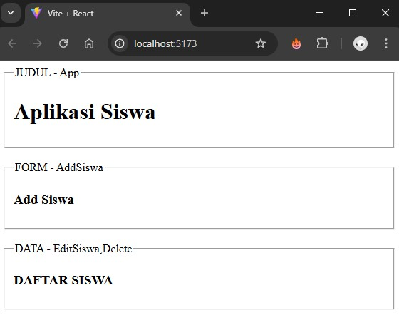
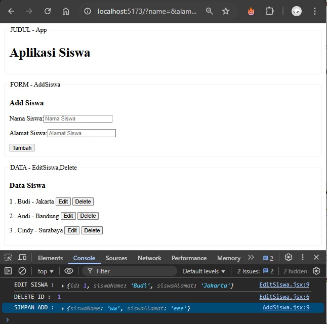

# REACT VITE 2025

## 1. PERSIAPAN AWAL

PERSIAPAN AWAL

```
npm create vite@latest siswa-app --template react
cd siswa-app
npm install
npm install nanoid
npm install --save-dev @playwright/test

```

GITHUB

```
git init
git add .
git commit -m "first commit"
git branch -M main
git remote add origin https://github.com/edycoleee/react25-1.git

```



## 2. MEMBUAT PAGE SISWA

GITHUB

```
git branch 01_mockpage
git checkout 01_mockpage
```

a. membuat halaman HomeSiswa.jsx, AddSiswa.jsx, EditSiswa.jsx
b. membuat mockup fungsi dan log
c. membuat fungsi add >> simpanAdd, edit >> simpanEdit
d. map data siswa untuk menampilkan semua data >> ingat perintah MAP

```
      {tbSiswa.map((siswa) => (
        <div key={siswa.id}>
          <p>
            {siswa.id} . {siswa.siswaName} - {siswa.siswaAlamat} {"  "}
            <button >Edit</button>{"  "}
            <button >Delete</button>
          </p>
        </div>
      ))}
```



## 3. MEMBUAT CRUD SISWA

GITHUB

```
git branch 02_crudarray
git checkout 02_crudarray
```
